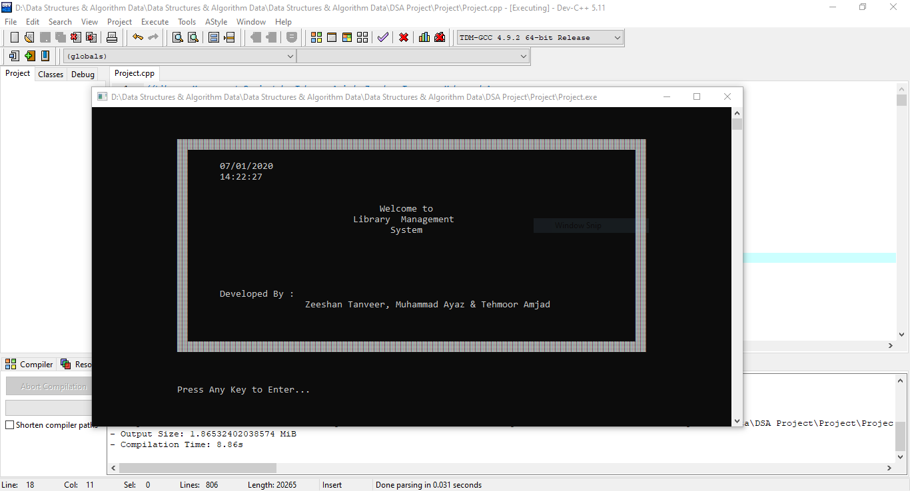
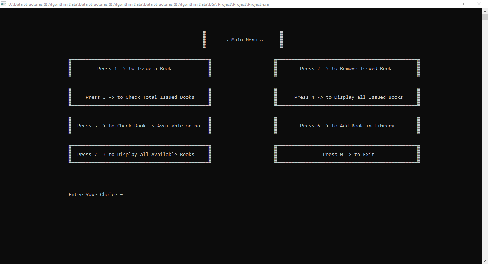
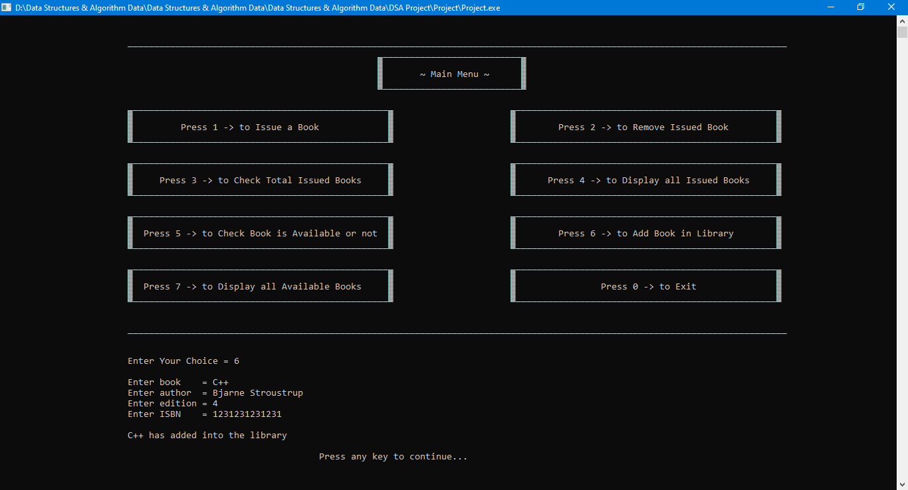
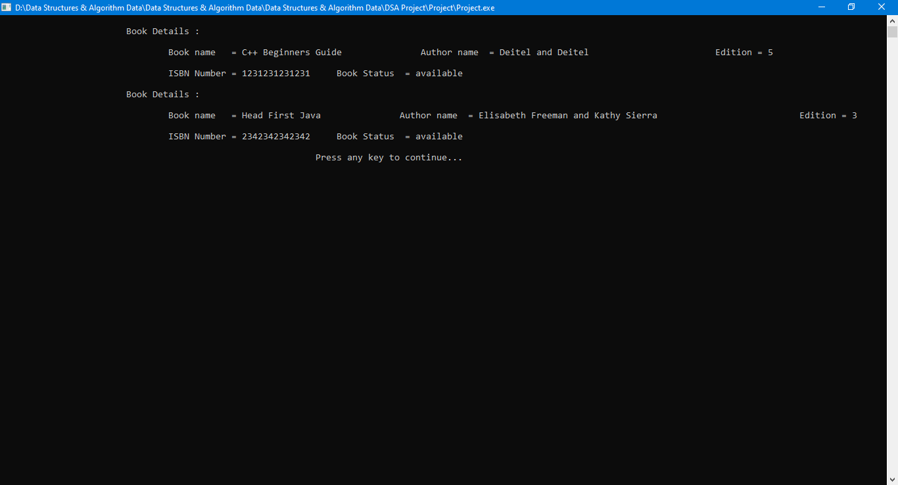
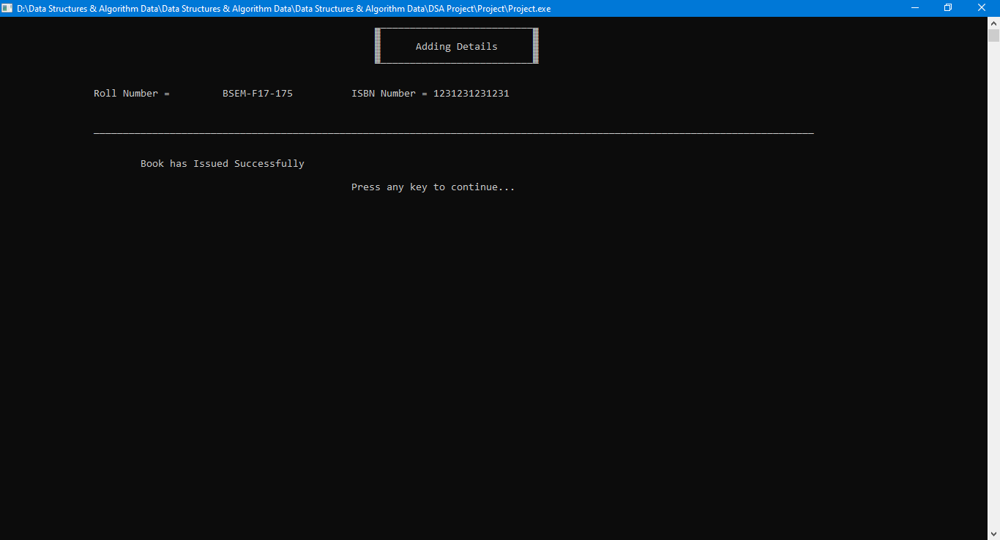
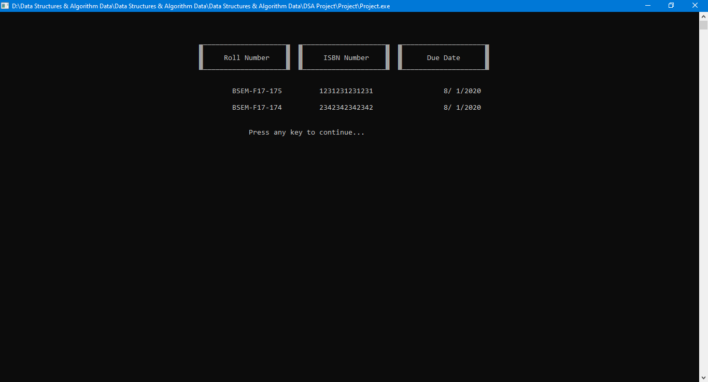
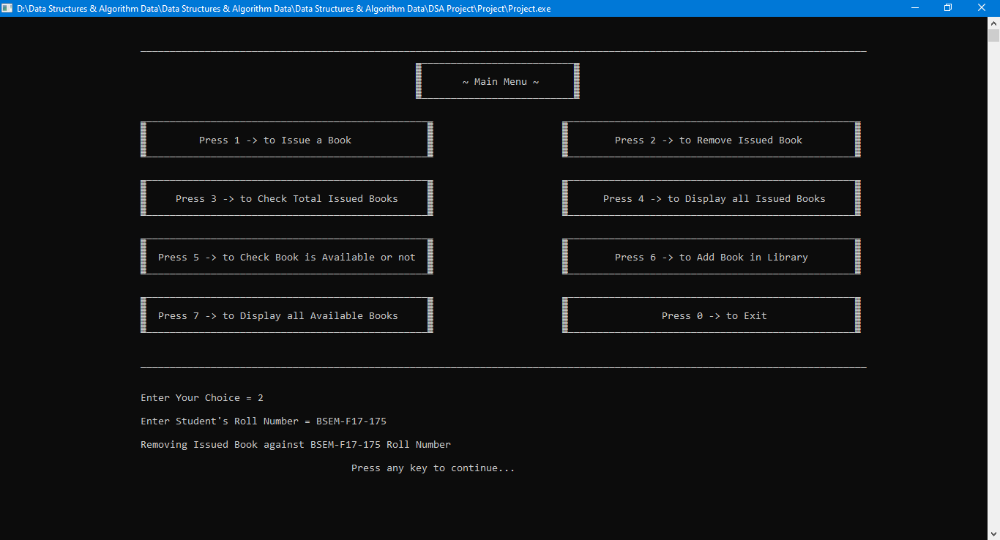

# Library Management System in C++ 
Library Management System in C++ 

In this Library Management System, Two Data Structures have used. One is Tree & the second is Double Linked List Data Structure. 
The Tree Data Structure that I have used in this project is to store data of Library Books. For this purpose, I created two classes, one class name is node that represents book name, author name, book edition, ISBN number & status. And the other class is Books that uses a private member of node class type that is root and 4 member functions in which one function is AddBook that adds books in our library, second function is inOrder which displays the available books in our library, third function is Search function, it searches the book against ISBN number entered by the user and returns the relative results. For example, if book is already issued, if book is available or not, or if ISBN number entered is wrong, it displays the appropriate message accordingly. And fourth and Last function is SearchNode which searches the node against entered ISBN number, if found then returns that node address else displays Book is not available. This is because when a book will be issue, the status of the book will have to change from available to issued and when the book will be return, the status again should be change from issued to available. All of this is to store books in our library.
The second Data Structure that I used in this project is Double Linked list to store the records of issued books to students. I have used two classes for this purpose, One class is nodeIssue which consists of private members rNum, ISBN, day, month & year. The rNum stores the roll number of the student who issue book, ISBN stores the book ISBN number which will be issued against him, and day, month & year stores the due date of the book that will be issue.
The Second class which is IssueBook consists of private members head & tail pointers of nodeIssue type. And the public member functions are createNode that issues book to a Student after checking whether Student has already issued any book or not. If not already issued any book then further asks for the user to enter book ISBN number to check whether book is available or not. If not available, it displays error message that “Book is not available” or if book is issued to someone then it displays “Book is already issued to someone” otherwise issue that book to the student & change the status of the book from available to issued. The second function is deleteIssueBook that removes book issued from the student & change the status of the book from issued to available. The third function length displays how many books have issued. The fourth function display shows the record of all issued books, includes their ISBN number, roll number & due date. The fifth function is checkRoll that checks if any book is issued or not to the entered roll number. And the sixth and last function is DueDate that stores the issued book duedate.      
Besides all of these, there are four more functions, one is getDate that displays the current date, getTime that displays the current time, AddingDetails that displays “Adding Details” because I repeatedly use this, so I made it a function & the last function is startUpMenu that displays a menu on program start up.

# Screenshots

